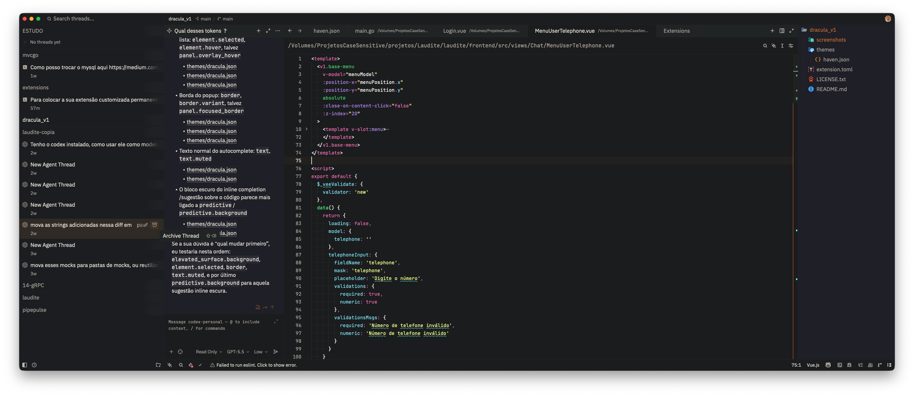
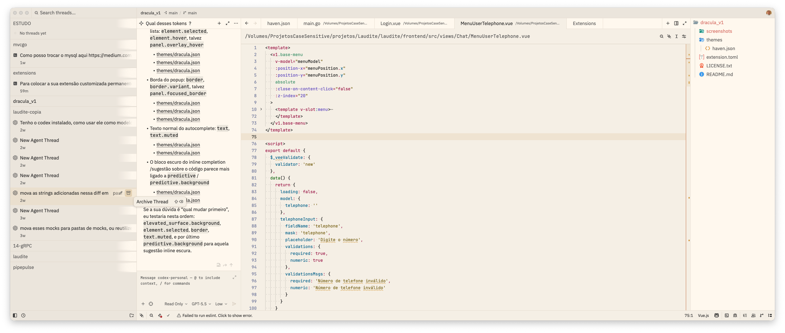

# Haven

Haven is a comfort-focused theme collection for Visual Studio Code, inspired by Dracula but shaped around a softer day-to-night editing experience.

## Background

This started as a personal customization of the Dracula themes I was using while refining colors, contrast, editor surfaces, active states, and syntax tones. Over time, the goal shifted from "another Dracula variant" to a theme collection centered on visual comfort.

During that process I started using a light theme again during the day. That pushed the work toward palettes that felt comfortable in both light and dark environments instead of treating the light side as an afterthought. The name Haven comes from that direction: a set of themes meant to feel like a visual refuge while coding.

## Included Themes

- `Haven Warm Dark Solid`
- `Haven Warm Light Solid`

## How It Differs From Dracula Variants

Haven keeps Dracula as an inspiration, but it is not intended to be a direct port of the original palette. This Visual Studio Code edition starts with the warm dark and warm light solid variants.

The main difference is the focus on comfort across a full day of use. Backgrounds, surfaces, selected states, line highlights, terminal colors, and muted text were tuned to reduce harsh contrast while keeping code readable.

## Screenshots

### Haven Warm Dark Solid

### Haven Warm Light Solid

## Contents

- `package.json`: extension metadata
- `themes/`: Visual Studio Code theme definitions
- `screenshots/`: theme screenshots
- `assets/`: extension icon and visual assets

## Author

Gerson Dantas
