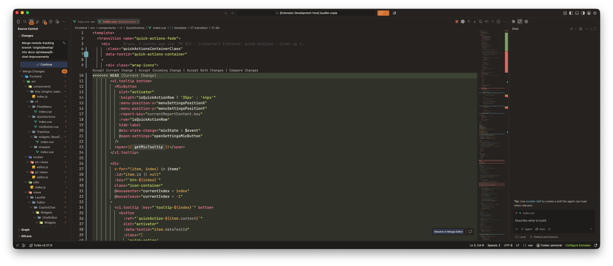
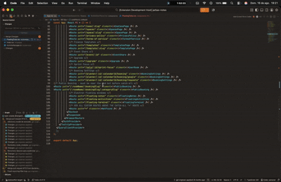
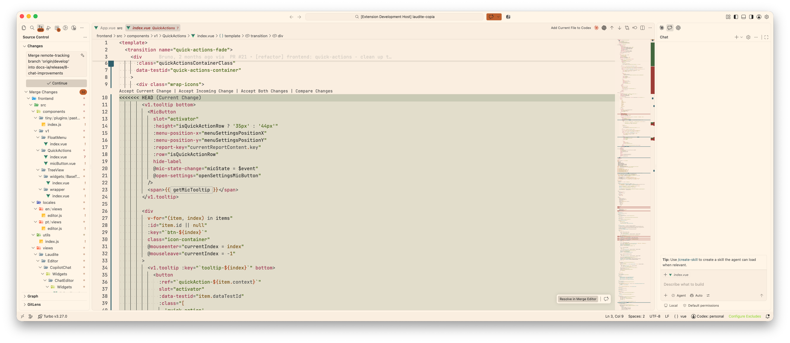
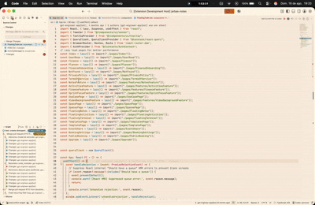
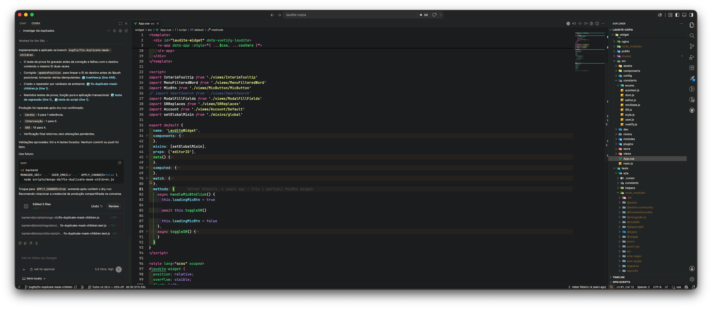
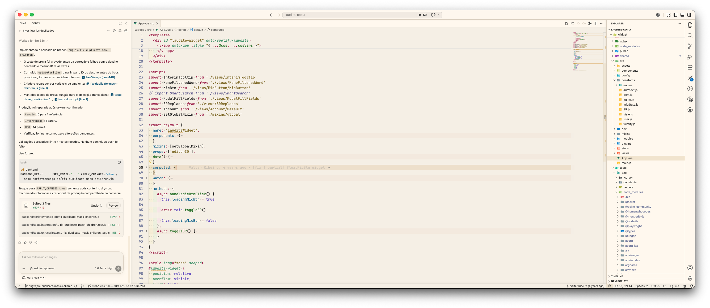

# Haven

<p align="center">
  <a href="https://buymeacoffee.com/gersonformd">
    
  </a>
</p>

<p align="center">Enjoying Haven? Support the project with a coffee ☕</p>

Haven is a comfort-focused theme collection for Visual Studio Code, designed for calm, sustained work across light and dark environments.

## Background

Haven means refuge. Its palettes combine warm paper, charcoal, stone, wood, copper, and amber tones to reduce visual harshness without sacrificing code structure or readability.

The guiding principle is: "Designed for focus, not for screenshots."

## Included Themes

- `Haven Dark`
- `Haven Light`
- `Haven Warm Dark Solid`
- `Haven Warm Light Solid`

`Haven Dark` and `Haven Light` share the same semantic color system, adjusted for their respective environments. The Warm Solid themes remain available as alternative palettes.

The primary pair is tuned for long programming, study, and writing sessions. Variables remain neutral, comments stay discreet, and color is reserved for structure, meaning, and state.

The main difference is the focus on comfort across a full day of use. Backgrounds, surfaces, selected states, line highlights, terminal colors, and muted text were tuned to reduce harsh contrast while keeping code readable.

## Automatic Light And Dark Setup

Installing Haven automatically contributes these defaults to Visual Studio Code:

```json
{
  "window.autoDetectColorScheme": true,
  "workbench.preferredLightColorTheme": "Haven Warm Light Solid",
  "workbench.preferredDarkColorTheme": "Haven Warm Dark Solid"
}
```

No manual configuration is required. This tells VS Code to use `Haven Light` when the system is in light mode and `Haven Dark` when the system is in dark mode. Existing user or workspace settings take precedence, so Haven does not overwrite personal preferences in `settings.json`.

Suggested system setup:

- macOS: open `System Settings > Appearance` and choose `Auto`. This is how I do it on my Mac.
- Windows: use a tool such as Auto Dark Mode, or schedule a system/theme switch with Task Scheduler to follow sunrise and sunset.
- Linux: if your desktop environment supports automatic appearance switching, use that. On GNOME/Ubuntu, a night-theme switcher extension or a small scheduled script is usually the practical option.

You can disable automatic switching at any time by changing `window.autoDetectColorScheme` in Settings.

## Screenshots

### Haven Dark





### Haven Light





### Haven Warm Dark Solid



### Haven Warm Light Solid



## Contents

- `package.json`: extension metadata
- `themes/`: Visual Studio Code theme definitions
- `screenshots/`: theme screenshots
- `assets/`: extension icon and visual assets

## Author

Gerson Dantas
